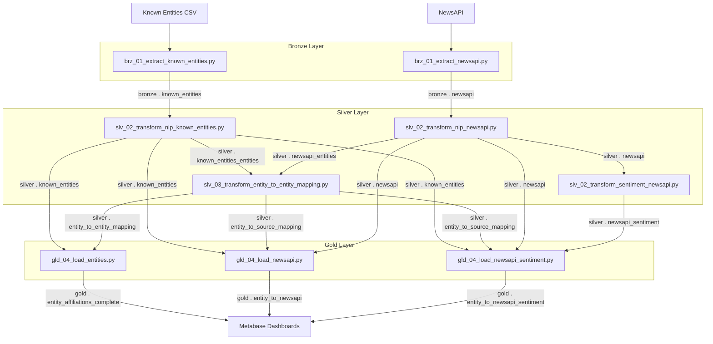
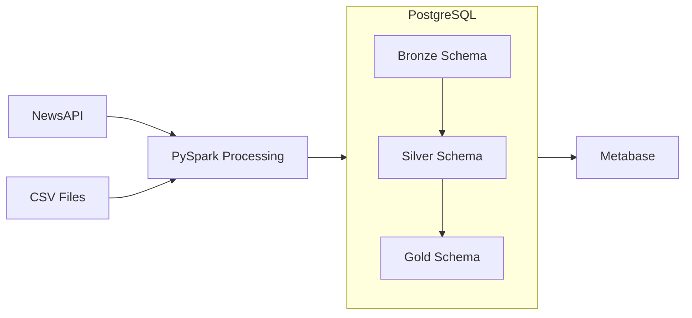
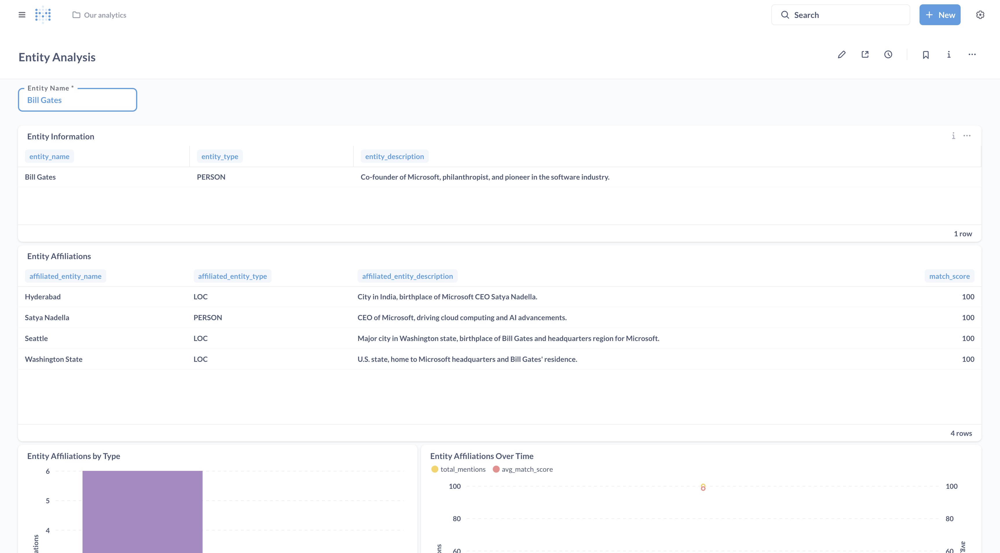
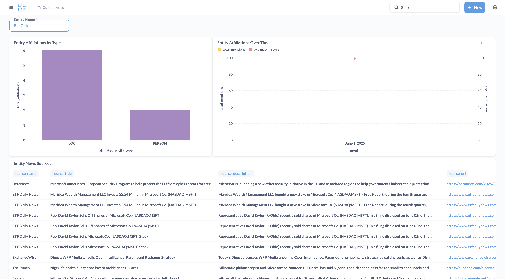
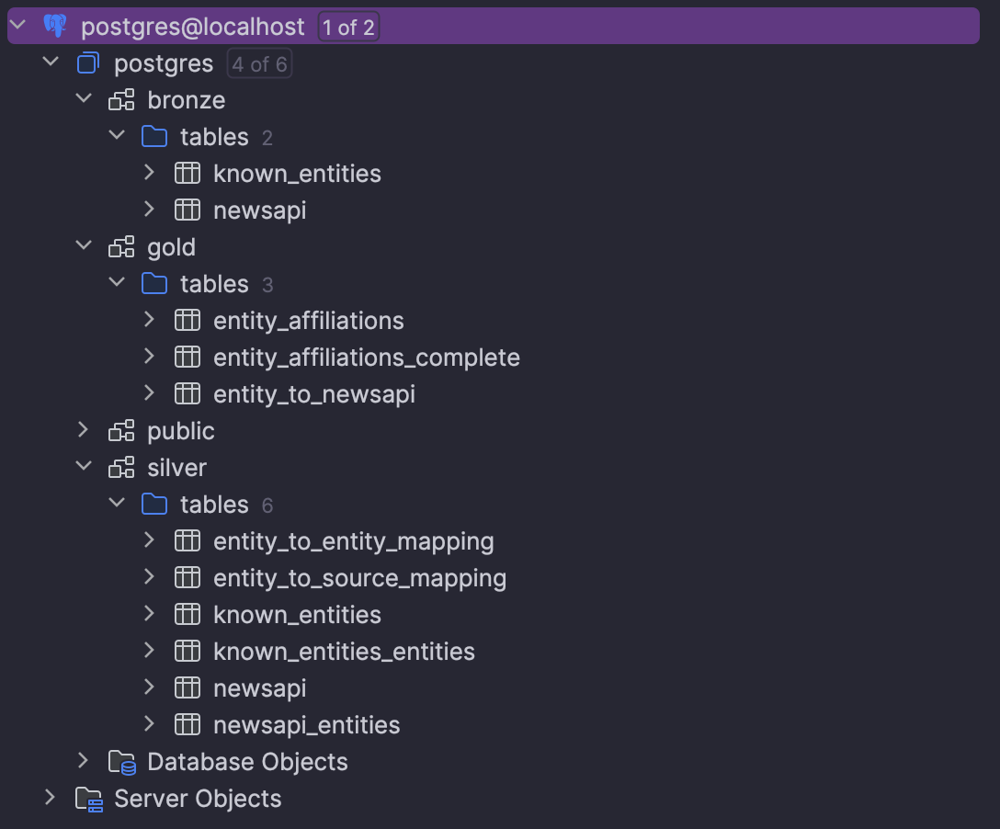

# Semantic Medallion Data Platform - Research Project (Derby University)

## Abstract

This study explores how to improve data lineage, attribute resolution, and contextual understanding across heterogeneous
data sources by incorporating Natural Language Processing (NLP) technologies into contemporary data processing
pipelines. Conventional constraints and keys are the mainstays of traditional Extract, Transform, Load (ETL) pipelines
for attribute resolution; these techniques are insufficiently sophisticated for increasingly complex and varied data
environments. By creating and putting into practice intelligent data processing pipelines that make use of NLP
capabilities within a medallion architecture framework, this study overcomes this limitation.

In order to extract individuals, organisations, and locations from real-time news data acquired through NewsAPI, the
research uses spaCy for named entity recognition as part of a practical implementation approach. In order to replicate
cloud-native solutions, the system architecture combines Hugging Face NLP models with Apache Spark processing
capabilities, which are deployed in containerised environments. PostgreSQL databases are used to store the results of
data processing, and Metabase offers reporting and visualisation features to show how effective the pipeline is.

The approach focusses on creating NLP-enhanced ETL pipelines that extract keywords for topic affiliation, entity
extraction to create intelligent data lineages across various sources, and sentiment analysis on unstructured blob data.
Performance evaluation measures improvements in attribute resolution accuracy, processing efficiency, and data lineage
completeness by contrasting NLP-integrated pipelines with conventional data processing techniques.

Key findings show that while retaining scalable processing performance, NLP integration greatly improves automated data
attribute resolution capabilities. The study shows quantifiable gains in contextual comprehension and data
categorisation accuracy, with entity extraction mechanisms effectively creating more intelligent data lineages than
traditional techniques. However, when integrating NLP processing in production ETL environments, the implications for
computational overhead must be carefully taken into account.

By offering concrete proof of the advantages of integrating NLP into enterprise data processing systems, this work
advances the expanding field of AI-enhanced data engineering. By bridging the gap between theoretical AI capabilities
and practical data engineering challenges, the research provides a repeatable framework for businesses looking to add
intelligent, context-aware capabilities to their data processing infrastructure.

---

## Architecture Overview

This project implements a medallion architecture for data lakes, which organizes data into three layers:

1. **Bronze Layer (Raw)**: Raw data ingested from various sources
2. **Silver Layer (Validated)**: Cleansed, validated, and transformed data
3. **Gold Layer (Business)**: Business-level aggregates and metrics ready for consumption

### Data Pipeline Architecture



### System Architecture



## Tech Stack

- **Data Processing**: PySpark
- **Database**: PostgreSQL
- **Transformation**: pyspark
- **NLP & Sentiment Analysis**: spaCy, Hugging Face Transformers
- **Reporting & Visualization**: Metabase
- **Local Development**: Docker, Poetry
- **External APIs**: NewsAPI
- **Infrastructure as Code**: Terraform

## Project Structure

```
semantic-medallion-data-platform/
├── .github/                      # GitHub Actions workflows
├── data/                         # Data files
│   └── known_entities/           # Known entities data files
├── docs/                         # Documentation
├── infrastructure/               # Infrastructure as Code
│   └── terraform/                # Terraform configuration for Digital Ocean
│       ├── main.tf               # Main Terraform configuration
│       ├── variables.tf          # Variable definitions
│       ├── outputs.tf            # Output definitions
│       ├── terraform.tfvars.example # Example variables file
│       └── setup.sh              # Setup script for Terraform
├── semantic_medallion_data_platform/  # Main package
│   ├── bronze/                   # Bronze layer processing
│   │   ├── brz_01_extract_newsapi.py        # Extract news articles from NewsAPI
│   │   └── brz_01_extract_known_entities.py # Extract known entities from CSV files
│   ├── silver/                   # Silver layer processing
│   │   ├── slv_02_transform_nlp_known_entities.py  # Extract entities from known entities descriptions
│   │   ├── slv_02_transform_nlp_newsapi.py         # Extract entities from news articles
│   │   └── slv_03_transform_entity_to_entity_mapping.py  # Create entity mappings
│   ├── gold/                     # Gold layer processing
│   ├── common/                   # Shared utilities
│   └── config/                   # Configuration
├── tests/                        # Unit and integration tests
├── docker/                       # Docker configurations
├── .pre-commit-config.yaml       # Pre-commit hooks
├── pyproject.toml                # Poetry configuration
└── README.md                     # This file
```

## Getting Started

### Prerequisites

- Python 3.9+
- [Poetry](https://python-poetry.org/docs/#installation)
- [Docker](https://docs.docker.com/get-docker/)

### Installation

1. Clone the repository:
   ```bash
   git clone https://github.com/yourusername/semantic-medallion-data-platform.git
   cd semantic-medallion-data-platform
   ```

2. Install dependencies:
   ```bash
   poetry install
   ```

3. Set up pre-commit hooks:
   ```bash
   poetry run pre-commit install
   ```

4. Create a `.env` file from the template:
   ```bash
   cp .env.example .env
   ```

   Edit the `.env` file to set your database credentials and other environment variables. Make sure to set your NewsAPI
   key if you plan to use the news article extraction functionality:
   ```
   NEWSAPI_KEY=your_newsapi_key_here
   ```

   You can obtain a NewsAPI key by signing up at [https://newsapi.org/](https://newsapi.org/).

### Local Development

Start the local development environment:

```bash
cd docker
docker-compose up -d
```

This will start:

- Local PostgreSQL database
- Metabase (data visualization and reporting tool) accessible at http://localhost:3000

### Running the ETL Pipeline

You can run the entire ETL pipeline using the provided shell script:

```bash
./local_run.sh
```

This script will execute all the necessary steps in the correct order, from Bronze to Gold layer.

Alternatively, you can run each step individually as described in the sections below.

### Running Tests

```bash
poetry run pytest
```

### Running Bronze Layer Processes

#### Extracting News Articles from NewsAPI

To extract news articles for known entities:

```bash
cd semantic-medallion-data-platform
python -m semantic_medallion_data_platform.bronze.brz_01_extract_newsapi --days_back 7
```

This will:

1. Fetch known entities from the database
2. Query NewsAPI for articles mentioning each entity
3. Store the articles in the bronze.newsapi table

#### Extracting Known Entities

To load known entities from CSV files:

```bash
cd semantic-medallion-data-platform
python -m semantic_medallion_data_platform.bronze.brz_01_extract_known_entities --raw_data_filepath data/known_entities/
```

This will:

1. Read entity data from CSV files in the specified directory
2. Process and transform the data
3. Store the entities in the bronze.known_entities table

### Running Silver Layer Processes

#### Processing Known Entities with NLP

To extract entities from known entities descriptions:

```bash
cd semantic-medallion-data-platform
python -m semantic_medallion_data_platform.silver.slv_02_transform_nlp_known_entities
```

This will:

1. Copy known entities from bronze.known_entities to silver.known_entities
2. Extract entities (locations, organizations, persons) from entity descriptions using NLP
3. Store the extracted entities in the silver.known_entities_entities table

#### Processing News Articles with NLP

To extract entities from news articles:

```bash
cd semantic-medallion-data-platform
python -m semantic_medallion_data_platform.silver.slv_02_transform_nlp_newsapi
```

This will:

1. Copy news articles from bronze.newsapi to silver.newsapi
2. Extract entities from article title, description, and content using NLP
3. Store the extracted entities in the silver.newsapi_entities table

#### Creating Entity Mappings

To create entity-to-entity and entity-to-source mappings:

```bash
cd semantic-medallion-data-platform
python -m semantic_medallion_data_platform.silver.slv_03_transform_entity_to_entity_mapping
```

This will:

1. Create entity-to-source mappings between known_entities_entities and newsapi_entities
2. Create entity-to-entity mappings within known_entities_entities using fuzzy matching
3. Store the mappings in silver.entity_to_source_mapping and silver.entity_to_entity_mapping tables

The entity mapping process uses fuzzy matching with RapidFuzz to identify similar entities across different data
sources. This enables semantic connections between entities even when there are slight variations in naming or
formatting.

#### Processing News Articles with Sentiment Analysis

To analyze sentiment in news articles:

```bash
cd semantic-medallion-data-platform
python -m semantic_medallion_data_platform.silver.slv_02_transform_sentiment_newsapi
```

This will:

1. Read news articles from silver.newsapi
2. Apply sentiment analysis to the content of each article using Hugging Face Transformers
3. Store the sentiment scores and labels in the silver.newsapi_sentiment table

The sentiment analysis process uses a pre-trained BERT model to classify the sentiment of each article as positive, negative, or neutral, along with a confidence score.

### Running Gold Layer Processes

#### Creating Entity Affiliations Wide Table

To create a comprehensive entity affiliations table for reporting:

```bash
cd semantic-medallion-data-platform
python -m semantic_medallion_data_platform.gold.gld_04_load_entities
```

This will:

1. Join entity-to-entity mappings with known entities data
2. Create a wide table with entity information and their fuzzy match affiliations
3. Create a bidirectional relationship table for complete entity affiliation analysis
4. Store the results in gold.entity_affiliations and gold.entity_affiliations_complete tables

#### Creating Entity to NewsAPI Source Resolution

To create a table mapping entities to news sources:

```bash
cd semantic-medallion-data-platform
python -m semantic_medallion_data_platform.gold.gld_04_load_newsapi
```

This will:

1. Join entity-to-source mappings with known entities and NewsAPI data
2. Create a wide table with entity information and their mentions in news sources
3. Store the results in gold.entity_to_newsapi table

#### Creating NewsAPI Sentiment Analysis Table

To create a table with sentiment analysis of news articles:

```bash
cd semantic-medallion-data-platform
python -m semantic_medallion_data_platform.gold.gld_04_load_newsapi_sentiment
```

This will:

1. Join news articles from silver.newsapi with sentiment analysis from silver.newsapi_sentiment
2. Create a table with article information and their sentiment scores and labels
3. Store the results in gold.entity_to_newsapi_sentiment table

These gold layer tables provide the foundation for the analytics and visualizations in Metabase dashboards, enabling
comprehensive entity analysis, news source insights, and sentiment analysis.

## Contributing

Please read [CONTRIBUTING.md](CONTRIBUTING.md) for details on our code of conduct and the process for submitting pull
requests.

## Infrastructure Setup with Terraform

This project uses Terraform to manage infrastructure on Digital Ocean, including a PostgreSQL database. Follow these
steps to set up the infrastructure:

### Prerequisites

- [Terraform](https://www.terraform.io/downloads.html) (version 1.0.0 or later)
- [Digital Ocean account](https://www.digitalocean.com/)
- [Digital Ocean API token](https://cloud.digitalocean.com/account/api/tokens)

### Setup Instructions

1. Navigate to the Terraform directory:
   ```bash
   cd infrastructure/terraform
   ```

2. Create a `terraform.tfvars` file from the example:
   ```bash
   cp terraform.tfvars.example terraform.tfvars
   ```

3. Edit the `terraform.tfvars` file to add your Digital Ocean API token:
   ```bash
   # Open with your favorite editor
   nano terraform.tfvars
   ```

4. Initialize Terraform:
   ```bash
   terraform init
   ```

5. Plan the infrastructure changes:
   ```bash
   terraform plan -out=tfplan
   ```

6. Apply the infrastructure changes:
   ```bash
   terraform apply tfplan
   ```

7. After successful application, Terraform will output connection details for your PostgreSQL database:
    - Database host
    - Database port
    - Database name
    - Database user
    - Database password (sensitive)
    - Database URI (sensitive)

### Infrastructure Components

The Terraform configuration creates the following resources on Digital Ocean:

- **PostgreSQL Database Cluster**:
    - Version: PostgreSQL 15
    - Size: db-s-1vcpu-1gb (1 vCPU, 1GB RAM)
    - Region: Configurable (default: London - lon1)
    - Node Count: 1

- **Database**:
    - Name: semantic_data_platform

- **Database User**:
    - Name: semantic_app_user

### Managing Infrastructure

- To update the infrastructure after making changes to the Terraform files:
  ```bash
  terraform plan -out=tfplan   # Preview changes
  terraform apply tfplan       # Apply changes
  ```

- To destroy the infrastructure when no longer needed:
  ```bash
  terraform destroy
  ```

For more detailed information about the infrastructure setup, see [INFRASTRUCTURE.md](docs/INFRASTRUCTURE.md).

For deployment instructions, see [DEPLOYMENT.md](docs/DEPLOYMENT.md).

## Visualization and Reporting

The Semantic Medallion Data Platform includes built-in visualization and reporting capabilities using Metabase. The gold
layer tables are designed to be easily consumed by Metabase for creating dashboards and reports.

### Metabase Dashboards

The platform includes pre-configured Metabase dashboards for entity analysis and insights:

#### Entity Analysis Dashboard

This dashboard provides comprehensive analysis of entities and their relationships:



#### Entity NewsAPI Insights Dashboard

This dashboard focuses on insights derived from news articles mentioning entities:



### Analytics Capabilities

The platform provides a rich set of analytics capabilities through SQL queries that can be used in Metabase dashboards:

#### Entity Analysis Queries

- **Entity Information**: Basic information about entities
- **Entity Affiliations**: Affiliated entities based on fuzzy matching
- **Entity Affiliations by Type**: Count of affiliated entities by type
- **Entity Affiliations Over Time**: Distribution of entity affiliations over time
- **Entity News Sources**: News sources mentioning specific entities
- **Top Entities by News Mentions**: Entities with the most news mentions
- **Entity Relationship Network**: Network visualization of entity relationships

#### Entity NewsAPI Insights Queries

- **Entity Match Quality Distribution**: Distribution of match quality scores
- **Entity News Source Timeline**: Timeline of news sources mentioning entities
- **News Source Distribution by Entity Type**: Distribution of entity types across news sources
- **Entity Affiliation Network Metrics**: Network metrics for entity affiliations
- **Entity Mention Frequency Over Time**: Frequency of entity mentions over time
- **Entity Similarity Analysis**: Identification of similar entities based on match scores
- **News Source Influence**: Influence of news sources based on entity coverage
- **Entity Affiliation Comparison**: Comparison of affiliations between entities
- **Entity Mention Context Analysis**: Analysis of the context of entity mentions
- **Entity Type Correlation**: Correlation between different entity types

These queries are stored in the `data/metabase_questions/` directory and can be imported into Metabase for creating
custom dashboards and reports.

### Database Client View

The PostgreSQL database can also be accessed directly using a database client:



## License

This project is licensed under the MIT License - see the [LICENSE](LICENSE) file for details.
