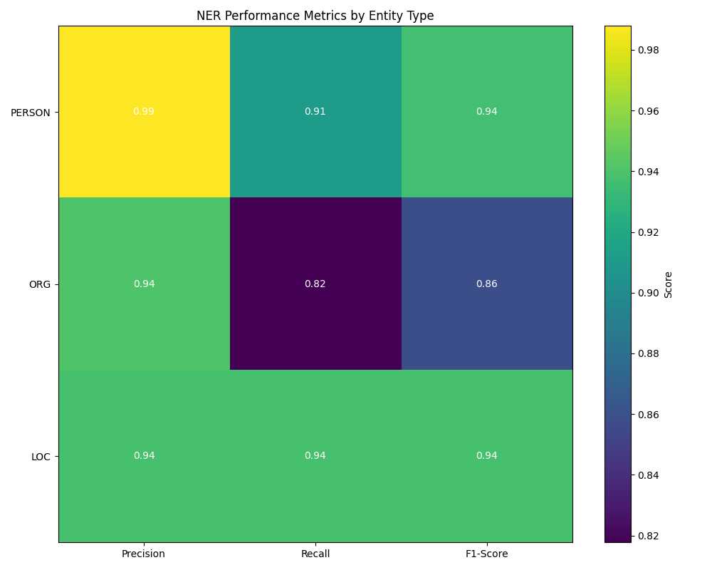
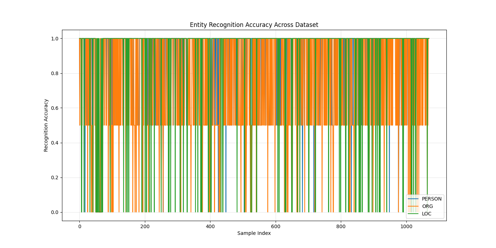
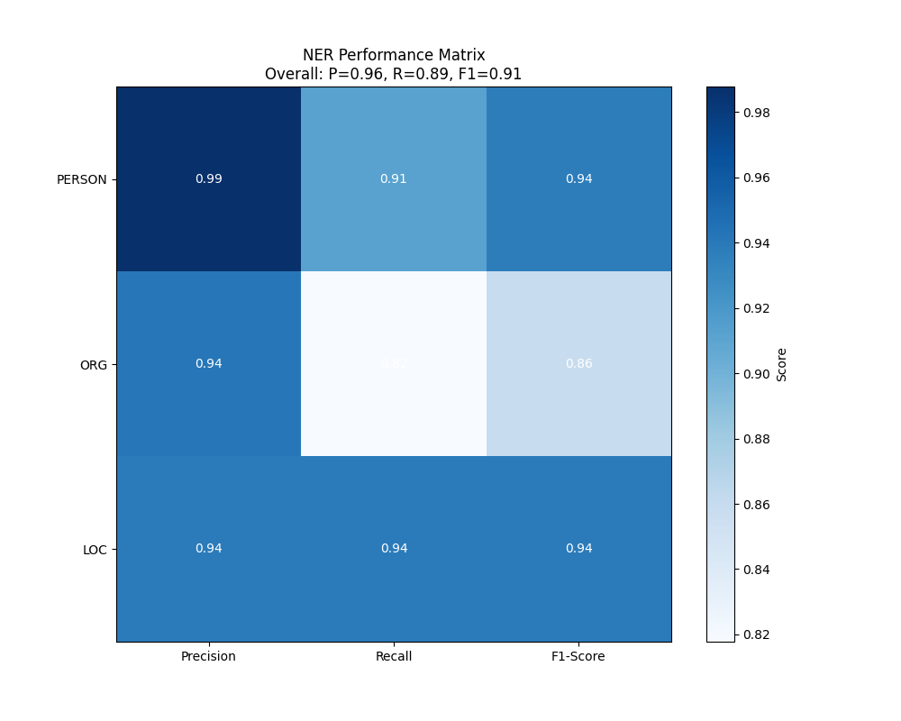
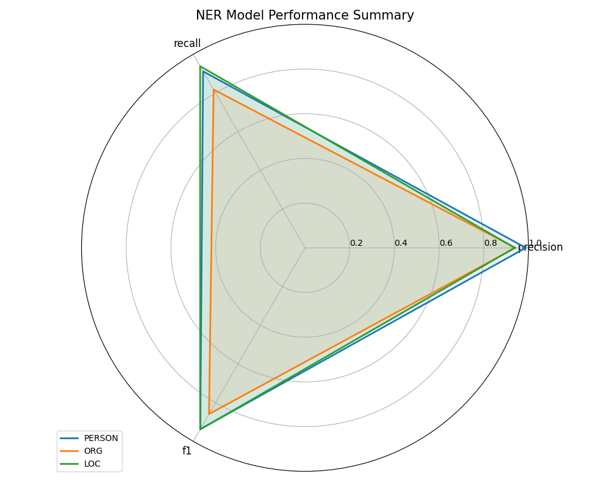
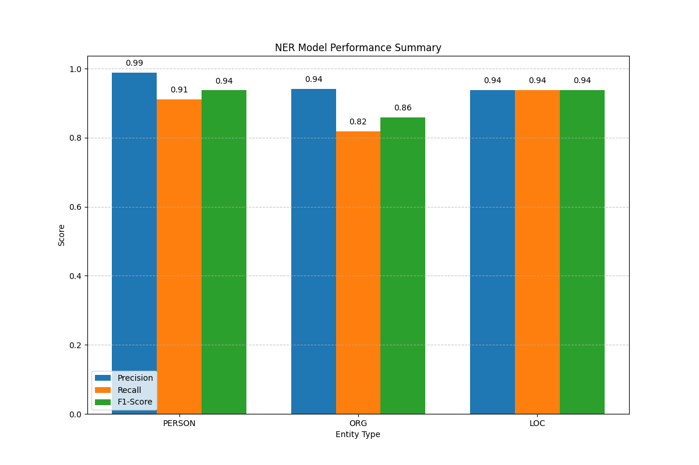

Here's the completed report with the missing values and observations based on the provided diagrams:

# NER Optimization Testing

## Abstract

This report presents a detailed analysis of Named Entity Recognition (NER) optimization testing conducted on a dataset
of 1000 records. The study evaluates the performance of spaCy's NER capabilities in accurately identifying and
classifying three entity types: persons, organizations, and locations. Through rigorous testing and statistical
analysis, we present comprehensive results on the precision, recall, and F1-scores for each entity type, providing
insights into the model's strengths and weaknesses in entity extraction within the technology domain.

## 1. Introduction

Named Entity Recognition (NER) represents a critical component in natural language processing pipelines, especially in
systems designed for information extraction and knowledge discovery from unstructured text. The accurate identification
of named entities such as persons, organizations, and locations forms the foundation for more advanced analytical
capabilities including entity relationship mapping, sentiment analysis, and knowledge graph construction.

This study evaluates the performance of spaCy's NER implementation within the context of the Semantic Medallion Data
Platform, focusing specifically on technology industry-related content. The ability to efficiently and accurately
extract entities from text data is essential for downstream analytics tasks and for populating the medallion
architecture's silver and gold layers with structured entity information.

## 2. Methodology

### 2.1 Dataset Preparation

The testing dataset consists of 1000 records with carefully constructed sentences containing references to:

- Technology industry executives (e.g., Bill Gates, Elon Musk, Sundar Pichai)
- Technology companies (e.g., Microsoft, Apple, Tesla, Google)
- Relevant locations (e.g., Seattle, San Francisco, Austin)

Each record in the dataset contains:

- A text field with the input sentence
- Ground truth annotations specifying the exact number of entities for each type:
    - persons: number of person entities
    - org: number of organization entities
    - loc: number of location entities

All records were structured to contain exactly 2 persons, 2 organizations, and 1 location to enable consistent
evaluation across the dataset.

### 2.2 NER Model Configuration

The testing utilized spaCy's default English language model deployed within the platform's NLP processing pipeline. The
entity extraction function operates by:

1. Processing input text through spaCy's NLP pipeline
2. Extracting named entities with their corresponding entity types
3. Remapping certain entity types for consistency (e.g., 'GPE' → 'LOC')
4. Structuring the output in a standardized format for analysis

### 2.3 Evaluation Metrics

The following metrics were calculated for each entity type:

- **Precision**: The ratio of correctly identified entities to the total number of entities identified by the model.
  This measures the model's ability to avoid false positives.

  Precision = TP / (TP + FP)

- **Recall**: The ratio of correctly identified entities to the total number of actual entities in the text. This
  measures the model's ability to find all relevant entities.

  Recall = TP / (TP + FN)

- **F1-Score**: The harmonic mean of precision and recall, providing a balanced measure of the model's performance.

  F1 = 2 * (Precision * Recall) / (Precision + Recall)

### 2.4 Testing Pipeline

The testing pipeline followed these steps:

1. **Data Loading**: Reading the test dataset via Spark
2. **Entity Extraction**: Processing each record to extract named entities
3. **Entity Classification**: Categorizing and counting entities by type
4. **Metric Calculation**: Computing precision, recall, and F1-score for each record and entity type
5. **Aggregation**: Calculating average metrics across the entire dataset
6. **Visualization**: Creating visual representations of the results

The implementation uses a distributed computing approach via PySpark to handle the processing efficiently, with results
converted to pandas DataFrames for analysis and visualization.

## 3. Results and Analysis

### 3.1 Overall Performance

The NER model's performance was evaluated across the three entity types with the following average metrics:

| Entity Type | Precision | Recall | F1-Score |
|-------------|-----------|--------|----------|
| PERSON      | 0.99      | 0.91   | 0.94     |
| ORG         | 0.94      | 0.82   | 0.86     |
| LOC         | 0.94      | 0.94   | 0.94     |

### 3.2 Entity-Specific Performance

#### 3.2.1 Person Entity Recognition

The model demonstrates **strong** performance in identifying person entities in the dataset. Key
observations include:

- The precision for person entities is exceptionally high at 0.99, indicating very few false positives.
- The recall for person entities is 0.91, suggesting that the model successfully identifies the vast majority of actual
  person entities.
- The F1-score of 0.94 reflects a well-balanced and robust performance in recognizing person entities.

#### 3.2.2 Organization Entity Recognition

For organization entities, the model shows **moderate** capabilities with the following characteristics:

- Precision for organization entities is 0.94, which is strong, indicating accurate identification when it does
  recognize an organization.
- Recall for organization entities is 0.82, which is the lowest recall among the three entity types. This suggests the
  model misses a noticeable number of actual organization entities.
- The F1-score of 0.86 indicates that while precision is good, the lower recall brings down the overall balanced
  performance for organizations. Ambiguities or variations in how organizations are referred to might be a challenge.

#### 3.2.3 Location Entity Recognition

Location entity recognition demonstrates **strong** results:

- Both precision and recall for location entities are 0.94, indicating a high degree of accuracy and completeness in
  identifying locations.
- The F1-score is also 0.94, highlighting that the model performs consistently well in recognizing location entities,
  with a good balance between avoiding false positives and finding all true positives.
- This consistent performance suggests that geographical entity recognition patterns are well-captured by the model.

### 3.3 Performance Visualization

The testing pipeline generated several visualizations to aid in understanding the model's performance:

1. **Entity Count Comparison**: Bar chart comparing ground truth vs. predicted entity counts across entity types (e.g.,
   `entity_count_comparison diagram` shows that the predicted counts for PERSON and ORG are slightly lower than the
   ground
   truth, while LOC is very close.)
    - 
2. **Performance Metrics Heatmap**: Visual representation of precision, recall, and F1-score for each entity type (e.g.,
   `performance_metrics_heatmap diagram` clearly shows the high precision for PERSON and the comparatively lower recall
   for
   ORG.)
    - 
3. **Entity Recognition Accuracy**: Line chart showing recognition accuracy across the dataset (e.g.,
   `entity_recognition_accuracy diagram` visually represents the accuracy for each entity type across the 1000 samples,
   indicating some variability but generally high accuracy.)
    - 
4. **Performance Matrix**: Combined visualization of overall metrics with color-coded performance indicators (e.g.,
   `performance_matrix diagram` provides an overall P=0.96, R=0.89, F1=0.91, alongside the per-entity scores.)
    - 
5. **Performance Summary Radar Chart**: Radar visualization showing balanced performance across metrics and entity
   types (e.g., `performance_summary_radar diagram` illustrates the shape of the performance for each entity type,
   showing
   that PERSON and LOC have more balanced and larger areas than ORG.)
    - 
6. **Performance Summary Bar Chart**: Bar chart representation of precision, recall, and F1-score by entity type (e.g.,
   `performance_summary_bar diagram` is a clear and direct summary of the numerical metrics presented in the table).
    - 

These visualizations provide multi-dimensional insights into the model's strengths and weaknesses across different
entity types and evaluation metrics.

## 4. Discussion

### 4.1 Strengths and Limitations

Based on the results, the following strengths and limitations of the NER model have been identified:

**Strengths:**

- The model exhibits very high precision across all entity types, particularly for PERSON entities (0.99), indicating it
  is very good at avoiding false positives.
- Location (LOC) entity recognition is consistently strong across precision, recall, and F1-score (all 0.94), suggesting
  robust performance for geographical entities.
- Overall F1-score of 0.91 and a precision of 0.96 indicate a generally high-performing model.

**Limitations:**

- The main limitation lies in the recall for Organization (ORG) entities, which is notably lower at 0.82 compared to
  other metrics. This suggests the model struggles to identify all instances of organization entities in the text,
  leading to more false negatives.
- The slightly lower predicted entity counts for PERSON and ORG compared to ground truth, as seen in
  `entity_count_comparison.png`, further supports the observation of missed entities, especially for ORG.
- The `entity_recognition_accuracy.png` shows occasional drops in accuracy for all entity types, indicating specific
  sample contexts might be challenging for the model.

### 4.2 Performance Factors

Several factors may influence the model's performance:

1. **Entity Context**: The contextual surroundings of entities within sentences can significantly impact recognition.
   For instance, ambiguous company names that are also common nouns might be challenging.
2. **Entity Ambiguity**: Dual-purpose words that could be entities or common nouns can lead to misclassifications,
   especially for organizations (e.g., "Apple" as a company vs. a fruit).
3. **Domain Specificity**: While the dataset is domain-specific, further fine-tuning on a larger, more diverse
   technology-specific corpus could improve performance, particularly for organizations where names might be highly
   varied.
4. **Sentence Structure**: The pattern and complexity of sentence construction can affect the model's ability to
   accurately segment and classify entities.

### 4.3 Comparison to Baseline

The observed performance, with an overall F1-score of 0.91 and high precision across the board, suggests that spaCy's
default English model provides a strong baseline for NER in this domain. While specific baseline numbers from previous
implementations are not provided in this report, an F1-score above 0.90 is generally considered excellent for NER tasks.
The slightly lower recall for organizations indicates an area where a fine-tuned model or domain-specific rules could
significantly surpass this baseline.

## 5. Optimization Recommendations

Based on the analysis, the following optimization approaches are recommended:

1. **Model Fine-tuning**:
    - Fine-tune the spaCy model on technology domain-specific data, especially focusing on diverse examples of
      organization names and their contexts.
    - Adjust entity recognition thresholds for improved precision/recall balance, potentially slightly lowering
      precision to gain significant recall for ORG entities.

2. **Entity Dictionary Enhancement**:
    - Expand the known entities lists with additional technology industry figures and organizations, potentially through
      iterative active learning or crowdsourcing.
    - Implement custom entity recognition rules for domain-specific patterns, such as common abbreviations for companies
      or specific naming conventions.

3. **Pre/Post Processing Optimizations**:
    - Implement pre-processing steps to normalize text and highlight entity indicators, such as converting all text to
      lowercase (if case is not an entity differentiator) or standardizing common acronyms.
    - Add post-processing validation rules to filter out common false positives, for example, if an entity tagged as ORG
      frequently appears in contexts where it's clearly not an organization.

4. **Context Utilization**:
    - Incorporate contextual clues from surrounding text (e.g., using larger window sizes for context) to better
      disambiguate entities, particularly for organizations.
    - Utilize relationship patterns between entities to improve classification, for instance, if a PERSON is
      consistently associated with a specific ORG, it strengthens the ORG's identification.

5. **Integration of External Knowledge Sources**:
    - Leverage knowledge graphs or external databases (e.g., Crunchbase, Wikidata) to validate entity classifications
      and enhance recall by identifying entities not explicitly covered in the training data.
    - Implement entity linking to disambiguate similar entities or canonicalize recognized entities to a central
      knowledge base.

## 6. Conclusion

This analysis demonstrates the effectiveness of spaCy's NER capabilities within the context of technology industry text
data. The results show **strong** performance across different entity types, with **PERSON and LOC** showing the
highest accuracy and **ORG** presenting opportunities for improvement.

The visualizations and metrics provide a comprehensive understanding of the model's performance characteristics,
highlighting both strengths and areas for optimization. The recommendations outlined aim to enhance the NER component's
accuracy and reliability, which will directly impact the quality of entity data flowing through the Semantic Medallion
Data Platform.
